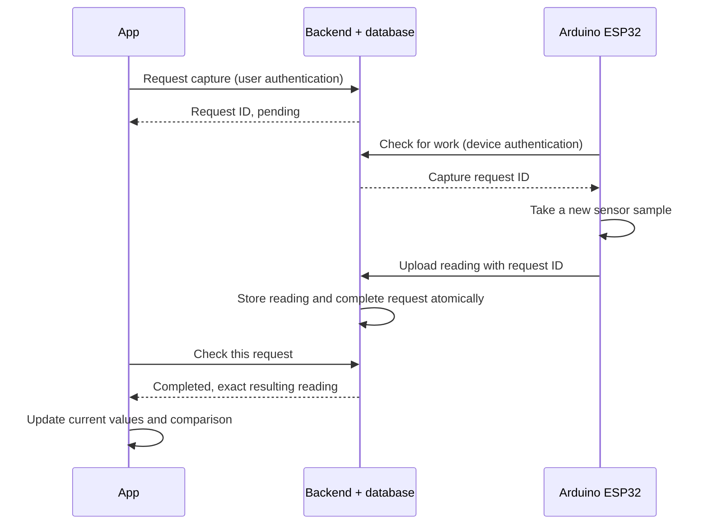

# Tabling version: capture, act, capture again

Status: software implemented on `stem-day`, 2026-09-24, through three Sol implementation/review loops. Automated verification passed; deployment, flashing, physical calibration/rehearsal, and actual-screen visual validation remain. See [TABLING_VERIFICATION.md](TABLING_VERIFICATION.md) for evidence and [TABLING_RUNBOOK.md](TABLING_RUNBOOK.md) for run/build steps. The original requirements and pre-implementation observations below are retained as the design record.

### Implementation decisions added during review

- Added `POST /devices/:deviceId/captures/cancel-pending` with `{idempotency_key}`. Reset records a cancelled request even before an uncertain create arrives, closing the lost-response/late-create race without using creation as setup inspection.
- Command polling explicitly returns HTTP 200; firmware accepts successful 2xx responses and validates their JSON. New commanded results require acquisition-age metadata; legacy scheduled uploads remain compatible.
- Tabling scheduled uploads use one attempt with short connection/read timeouts so background work cannot occupy the full capture deadline. Ordinary firmware retains its scheduled interval and longer retry policy.
- Editing a selected plant's species or challenge ranges resets preparation rather than reclassifying an earlier group's captures. Failed re-verification invalidates setup approval, and pending/failed rechecks label prior results explicitly.
- Kept the existing application identity and ordinary simulator behavior. The isolated command simulator is a separate `npm run sim:tabling` command; no simulator traffic was sent to a physical device or cloud database.
- Added CI jobs for SQL constraints/races, both firmware modes and the command simulator, plus actual mounted-hook tests. One existing backend enrichment file received formatting-only fixes to satisfy the full lint gate.

No credentials, device identifiers, calibration constants, deployment target, or physical rehearsal measurements were invented. Software checks do not close the remaining event-preparation gates at the end of this document.

## Start here: context for the next agent

The user will hand this document to a new implementation agent without the planning conversation. Read it in full, inspect the referenced current source, and implement the work in the sequence below. The user's tabling requirements extend the original MVP in `docs/HANDOFF.md`; old restrictions to 15-minute-only uploads do not prohibit this explicitly requested feature. Preserve the ordinary app experience when tabling mode is off.

User-confirmed requirements:

- Children solve a physical plant-condition challenge by measuring, making a change, and measuring again.
- Only **light and soil moisture** are challenge metrics. Light is changed/reset with an adjustable lamp. Temperature and humidity do not determine activity success.
- Continuous power and internet are available. Use the existing cloud architecture; offline operation is outside this implementation.
- Include **capture buttons, current conditions, and a Before -> Now comparison**. This comparison is required, not an optional later phase.
- Staff physically restore the out-of-range setup between groups. The software reset clears the activity, not the physical environment or historical data.
- **Replaceable soil samples are confirmed.** Each group adds small amounts of water to a prepared dry sample beside the plant; staff replace it with another prepared sample for the next group. The user accepted this in response to the moisture-reset clarification. Do not design around rapidly drying the planted pot.

Implementation defaults selected for this plan (not additional user requirements): one shared staff-operated phone/tablet, one event plant/device, staff sign-in, local group state that resets on app restart, existing species target ranges, and normal scheduled uploads retained. No child accounts, personal information collection, durable group analytics, multi-tablet coordination, or remote watering/lamp control are required.

Software implementation can proceed with these defaults. Sample preparation details, calibration, exact event device/account, screen/platform, and deployment credentials/target are event-preparation inputs; do not invent their values or claim a hardware rehearsal was completed. Record any necessary implementation deviation in this file and `PROGRESS.md`.

## Intended experience

Children inspect a real sensor reading, identify a condition outside the target range, change the physical setup, and capture again to see what changed. Staff restore the starting conditions between groups.

Start with one staff-operated app/tablet and one continuously powered Arduino Nano ESP32. Keep the normal 15-minute uploads and add explicit captures. Separate app, firmware, and backend settings select the event UI, frequent command checks, and event-device eligibility respectively; an Expo flag alone does not change the board. The existing demo login flag serves a different purpose.

## What the code does today

| Area | Current behavior | Consequence for this change |
| --- | --- | --- |
| [Firmware](../firmware/src/main.cpp) | Samples every 30 seconds; posts the cached sample every 15 minutes; stays awake. | Add command checks and force a new sample when commanded. No wake-from-sleep mechanism is needed. |
| Sensor acquisition | `takeSample()` collects 11 samples with 200 ms delays, taking at least about 2.2 seconds. | Show a measuring state; promise a few-second interaction only after hardware verification. |
| Local `/data` endpoint | Returns the cached local reading; the app does not use it. | Calling it alone would not guarantee a fresh measurement or cloud upload. |
| [Sensor API](../backend/src/sensors/sensors.controller.ts) | Ingests readings; authenticated GET returns the newest stored row. | Add a separate command path. Refreshing this GET cannot command the board. |
| [Plant Data screen](../app/src/screens/PlantDataScreen.tsx) | Gauges already use the latest stored reading. Refresh also fetches history; focused polling defaults to 60 seconds. | Render command results immediately and load history independently. |
| [Device status](../backend/src/devices/devices.service.ts) | A reading less than 45 minutes old counts as online. | Add recent command contact as a readiness signal, separate from measurement age. |
| [Alerts](../backend/src/alerts/alerts.service.ts) | Repeated alerts are subject to a two-hour cooldown. | Evaluate activity feedback from each reading and its target ranges, independently of alerts. |
| [Demo mode](../README.md) | Auto-login uses the same backend/database as the normal app. | A branch or demo login alone does not isolate event data or deployment. |

Some older handoff/deployment descriptions lag the firmware: the current board already has a Wi-Fi setup portal and local debug server. Implementation should follow the current source and actual flashed hardware.

### Clarification: filtering, rounding, and freshness

The current-condition gauges do **not** average multiple historical uploads. The backend orders sensor rows by descending receipt timestamp and selects one row (`SensorsService.latest()` and `PlantsService.hydrate()`); Home and Plant Data use that row directly.

There are three different operations that can look like averaging:

1. The firmware's `takeSample()` collects 11 sub-samples spaced 200 ms apart and selects a median for each metric. Although the helper trims two values at either end, the selected index is still the sixth of the sorted 11 values: an ordinary median over this one short acquisition window. It does not combine previous 30-second batches or 15-minute uploads.
2. Firmware serializes values to one decimal place. The UI further rounds moisture/light to whole numbers and abbreviates large values with `k`. These are numeric presentation choices, not history aggregation.
3. Historical charts select every nth stored point when dense and draw curved lines. Chart processing does not feed the current gauges.

Keep the short median filter in tabling mode: it reduces sensor noise while every sub-sample in a commanded batch is acquired after the command. The required architecture change is a new request-and-result path, immediate upload, and immediate UI update. Removing a historical average is unnecessary because none exists in the current-values path.

For the event, display moisture with one decimal place and light in full lux units; use the available stored precision and compare unformatted numbers to thresholds. Do not claim more sensor accuracy than calibration establishes. Near a boundary, ensure the displayed precision does not contradict the status label. Check hardware behavior before changing the batch duration.

## Separating tabling and normal modes

Use one maintained codebase with explicit configuration at three layers. This is **tabling mode**, not the agent's planning mode and not the existing demo-login mode.

| Layer | Normal default | Tabling configuration | Responsibility |
| --- | --- | --- | --- |
| Expo app | `EXPO_PUBLIC_TABLING_MODE=false` | `true` in a new `tabling` EAS profile / local launcher | Select event navigation, two-metric activity, comparison, and facilitator controls. |
| Firmware | `TABLING_MODE=0` | `TABLING_MODE=1` in a dedicated PlatformIO environment | Enable outbound command polling; keep normal 30-second sampling and 15-minute uploads. |
| Backend device | `devices.tabling_enabled=false` | Enable only the event device through trusted administration | Permit capture commands and apply event notification policy. Never trust the client flag as authorization. |

### Expo setup

- Add a central config constant using the literal expression `process.env.EXPO_PUBLIC_TABLING_MODE === 'true'`. Absence means false. Expo statically replaces `EXPO_PUBLIC_*` references in the JavaScript bundle; the flag is public configuration, never a place for passwords or device secrets. [Expo environment variables](https://docs.expo.dev/guides/environment-variables/)
- Add an EAS profile named `tabling` that extends the existing `preview` profile. Set tabling true and demo mode false explicitly. Set tabling false explicitly in ordinary profiles. Use the default EAS `preview` environment for shared public connection settings, populating it during setup if necessary; a build profile named `tabling` does not require a custom EAS environment of the same name. [EAS build profiles](https://docs.expo.dev/build/eas-json/), [EAS environments](https://docs.expo.dev/eas/environment-variables/manage/)
- Proposed profile fragment (merge with existing configuration rather than replacing it):

  ```json
  "tabling": {
    "extends": "preview",
    "environment": "preview",
    "env": {
      "EXPO_PUBLIC_TABLING_MODE": "true",
      "EXPO_PUBLIC_DEMO_MODE": "false"
    }
  }
  ```

- Add `npm run tabling` using a Windows-compatible Node launcher based on `app/scripts/start-demo.js`. Set tabling true and demo false for the child process and run `expo start --clear`, forwarding arguments. Explicitly keep tabling false for the normal and demo launchers so an old local environment value cannot silently switch their UI. Keep normal demo behavior otherwise unchanged.
- After implementation, local usage is `cd app` then `npm run tabling`; an Android event build is `eas build --profile tabling --platform android`. Pick iOS/Android and build credentials during event preparation; do not assume the existing development profile's iOS simulator build works on a physical iPad.
- Staff sign in using a dedicated event account and finish existing setup/onboarding before the activity. `EXPO_PUBLIC_DEMO_MODE` only controls the existing seeded-user login; it is not needed for tabling and must not be used to inject readings.
- Add a `TablingScreen`/event navigation branch after normal authentication and profile readiness, selected by the central flag. Keep normal Home/Plant Data navigation when false. Select the owned event plant/device during facilitator setup; do not hardcode real IDs into components.
- For the first release, a profile can use the existing application identity. Installing normal and event variants side by side is optional: if needed, use dynamic app config with a distinct display name, package/bundle ID, and URL scheme, preserving other settings. Expo requires unique native IDs for co-installation. [Expo app variants](https://docs.expo.dev/build-reference/variants/)
- If publishing over-the-air updates later, explicitly apply the correct flag and isolate the event update channel; `eas update` must not be assumed to inherit a build profile's `env` values. Initial delivery can use a verified standalone event build without adding OTA work.

### Firmware and backend setup

- In `firmware/platformio.ini`, add `env:arduino_nano_esp32_tabling` extending the current board environment with `-DTABLING_MODE=1`; define the macro as zero when absent in source. Preserve inherited dependencies/build flags. Document explicit `pio run -e arduino_nano_esp32_tabling` and `pio run -e arduino_nano_esp32_tabling -t upload` commands. Document the equivalent define for the Arduino IDE workflow.
- Store `tabling_enabled` as a server-controlled per-device field, default false. Include eligibility and recent command-contact information in the owned-device response so facilitator setup can diagnose a normal firmware build or inactive device. Retain the ordinary ownership and device-token checks.
- Reject new captures when the device is not enabled. If enablement is removed or ownership changes, stop issuing its commands and invalidate active requests. The firmware build flag is not an authorization credential.
- For an enabled event device, store scheduled and commanded readings but suppress normal alert/push evaluation; the event screen supplies its own per-reading feedback. Other devices retain their existing alert behavior and cooldowns. Document resetting this device setting after the event.
- A missing backend capability, disabled device, or stale command contact must show a facilitator-facing setup message rather than a button that appears to work. Heartbeat proves connectivity only, not successful sensor acquisition.

## Required group workflow

1. **Prepare:** staff place a prepared dry soil sample beside the plant, insert the probe consistently, and reset the adjustable lamp. Use a facilitator **Verify setup** capture to check both challenge metrics are valid and outside their target ranges (normally too dry and too dark). Preparation readings do not become the child's Before snapshot.
2. **Check plant now:** children capture the starting conditions. Store this first successful group capture as the fixed **Before** snapshot. A failed capture cannot initialize the comparison.
3. **Investigate:** display light and soil moisture prominently with values, units, target ranges, and the words **Too low**, **In range**, **Too high**, or **Unknown**. Ask what they think they should change; avoid giving away the solution immediately.
4. **Make a change:** children adjust the lamp and add a small measured amount of water to the soil sample. Let water distribute for the interval established during rehearsal, then capture again. Do not invent a universal dose or settling time.
5. **Check again:** a new commanded capture updates **Now** in the Before -> Now comparison. Allow repeated attempts. Both light and moisture must be valid and in range in this same capture for **Both conditions are in range**. Temperature/humidity values never block this outcome merely because they are out of range.
6. **Next group:** a facilitator control clears the comparison and active group state, cancels outstanding requests, and enters preparation mode. Staff replace the soil sample, reset the lamp, and verify again. Keep historical readings in the database.

Use conditions language: a sensor snapshot does not establish the plant's overall biological health. Label the moisture card **Soil sample moisture** because the probe is in a demonstration sample beside the plant. Show the species target context without claiming this is a measurement of the planted root zone. Temperature/humidity may remain available in a secondary details view; they are not challenge cards or completion criteria.

### Moisture reset and calibration procedure

Use fresh prepared samples rather than a same-pot wet/dry cycle. This is an operational choice for repeatability: draining a container removes drainable water, while water remains held in the soil. It does not immediately restore the earlier dry reading. [University of Minnesota Extension: drainage](https://extension.umn.edu/natural-resources/conservation/agricultural-soil-and-water/how-agricultural-drainage-works)

- Prepare enough comparable containers of the same soil mix for the expected groups plus spare attempts. Use consistent fill level, packing, and marked probe insertion depth. Keep a supply of prepared dry mix for refills if needed; do not rely on used samples drying during a short break.
- Keep the probe in one sample throughout a group's attempts. Staff handle swapping and remove surface moisture/soil residue from the sensing portion between samples as appropriate for the actual probe. Check the next dry sample's reading before admitting the next group.
- During rehearsal, find small water increments and a repeatable waiting interval that move this sample into the chosen target range without immediately overshooting. No numeric dose or delay is specified until this is tested on the actual soil and probe.
- Verify the actual probe model's calibration and immersion limits. The repo has calibration placeholders (`DRY_RAW`/`WET_RAW`). Representative capacitive-probe documentation notes that insertion depth and soil packing affect the output; it does not establish which exact model is attached here. [DFRobot calibration reference](https://wiki.dfrobot.com/sen0193/docs/18037)
- Treat the mapped 0-100% as a calibrated sensor scale, not a laboratory measurement of volumetric water content. Confirm the selected species' light/moisture ranges exist and are practical to demonstrate; do not secretly alter shared species data to force a success state.
- Retire used wet samples for later drying/reuse. If the sample becomes too wet for that group's challenge, staff can restart with another prepared sample using the same reset workflow.

## Recommended command path

Use the existing HTTPS backend with a small durable capture-request table. The ESP32 asks the backend for work approximately every two seconds in event mode. The app checks the specific request approximately every second while waiting. These are starting settings to measure and tune, not promised latency.



This fits the existing HTTP stack and keeps all board connections outbound. A broker or persistent socket would add another connection lifecycle to operate. Power and internet are confirmed, so local/offline transport is outside this work.

### Backend and database

Planned routes (keep the client, device, API tests, and documentation aligned):

| Route | Authentication | Responsibility |
| --- | --- | --- |
| `POST /devices/:deviceId/captures` | User JWT + current device ownership | Create/reuse a capture using a client idempotency key; return its ID promptly. |
| `GET /devices/:deviceId/captures/:captureId` | User JWT + current device ownership | Return request state and its result reading when completed. |
| `GET /devices/:deviceId/active-capture` | User JWT + current device ownership | Read active request ID/state/expiry or null for setup/recovery; never create a capture. |
| `POST /devices/captures/poll` | Device token + `device_id` body | Return only this device's unexpired work and record command contact. |
| Existing `POST /sensors/readings` | Device token | Accept an optional capture request ID; scheduled uploads remain valid. |
| `POST /devices/captures/:captureId/fail` | Device token + `device_id` body | Report failed sensor acquisition/upload preparation without claiming success. |
| `POST /devices/:deviceId/captures/:captureId/cancel` | User JWT + current device ownership | Cancel obsolete work for reset/teardown. |

The existing device guard gets `device_id` from the request body, which is why the polling route above uses POST. If a GET route is chosen instead, deliberately extend the guard rather than assuming it accepts route parameters already.

Add `capture_requests` with device/requester IDs, state, creation/expiry times, result-reading ID, and failure reason. Suggested states: pending, measuring, completed, failed, expired, cancelled. Add a nullable unique capture-request reference to readings. Protect the new table with RLS and enforce ownership/device checks in the backend, including when completing or reading a request.

- Allow at most one active capture per device. Deduplicate submissions with the same idempotency key in the database as well as the app. If a different key arrives while a request is active, return a conflict and its ID; do not silently reuse an older group's capture. Reset/recovery must cancel obsolete work before creating a new request.
- Claim work atomically. Never issue expired/cancelled work on a later poll, and give the device a remaining-time budget for work it receives. A command already received may finish physically before cancellation is known to the board; reject its obsolete result and prevent it from becoming the next group's capture.
- If a poll response is lost, subsequent polls must be able to obtain the same active request until it expires/completes. Firmware keeps the current request ID and buffered sample so redelivery does not trigger another measurement after one was already acquired. On board reboot without a buffered sample, it may take a new batch for a still-active request; never invent an earlier result.
- Validate that a submitted request belongs to the authenticated device and is still eligible for completion.
- Atomically insert the reading and complete the request. A restricted Postgres function called by the backend is one implementation option; Supabase supports database functions through its API. [Supabase documentation](https://supabase.com/docs/guides/database/functions)
- Make repeated uploads of the same capture idempotent. A lost HTTP response must not create duplicate readings or repeat side effects.
- For a completed request, an authenticated retry returns the original result even if its original deadline has now passed. A not-yet-completed request that has expired/cancelled is rejected. Make completion and cancellation atomic competitors so their outcome cannot disagree.
- Keep alert delivery separate from whether a reading was successfully stored. A push error must not make the activity report a failed capture after the data was committed.
- Track last command contact separately from the last sensor reading. A working network connection does not make an old reading fresh.
- Use a bounded request lifetime, initially around 30 seconds for a warmed backend, with a clear retry path. Retransmitting the same network operation reuses its idempotency key/request. An explicit new attempt after failure/expiry creates a new key/request and takes a new sample.

### Firmware

- Add event-mode polling on a timer, independent of the 15-minute upload schedule. Back off on network failures rather than retrying continuously.
- When a new request arrives, start `takeSample()` after receiving it. Do not relabel the existing `latest` cache as the requested measurement.
- Give commanded capture priority over background sampling; serialize sampling/uploads to avoid changing the data during an upload.
- Refactor `postReading()` to return a meaningful outcome. Hold sensor values and request ID unchanged across retries; recompute only sample-age metadata at transmission so retry delay is represented accurately.
- Report sensor failure explicitly instead of silently skipping the upload. Keep request expiry, HTTP timeouts, and retry budgets consistent.
- Preserve the normal scheduled path; an unrelated scheduled upload must never satisfy a capture request.
- Retain the server timestamp as receipt time. Include sample age at transmission, or another explicit acquisition-time mechanism, so a delayed upload is not presented as freshly measured. Relative sample age avoids requiring a synchronized board clock; any derived capture time must be treated as approximate.
- Include acquisition metadata for scheduled uploads too. Define latest by acquisition time with a stable tie-breaker in both sensor and plant queries, as well as the UI, so a delayed older sample cannot become current merely because it arrived last. Legacy uploads without acquisition metadata can remain compatible, but must be identified as having receipt time only.
- Account for the existing blocking sensor delays and network calls when measuring responsiveness. Improve their scheduling if event tests show they delay commands excessively.

For timestamp implementation, keep `ts` as receipt time and add a consistently populated effective acquisition timestamp plus a time-source marker (estimated from sample age versus receipt-only for legacy rows). Backfill legacy effective times from `ts`, and set the same fallback for older firmware uploads. Sort both latest queries by effective acquisition time with reading ID as a stable tie-breaker. A sample-age estimate includes some network uncertainty; request identity plus a fresh batch is the proof that a button result belongs to that capture. Do not present an estimate as a perfectly synchronized sensor clock.

Retain the current four-field ingest contract for this release. The board still acquires temperature/humidity, so their sensor must function even though their ranges do not affect activity completion. Partial-sensor payload support would be a separate change; preflight must check all attached sensors are working.

Initial end-to-end target: roughly 5-10 seconds under a stable connection with a ready backend. This is an engineering target to validate, not a guarantee; the current acquisition alone takes over two seconds.

### App and display

- Add a large **Check plant now** / **Check again** button near the plant's current values. Disable it during an active request and show **Waiting for sensor** or **Measuring** based on real progress.
- Apply the completed request's exact reading immediately to its intended group snapshot (Before or Now). Update Current only if its acquisition-time/ID ordering is at least as new as the current row; if a newer scheduled sample already arrived, retain it in Current and show the capture in comparison with its own timestamp. Preparation captures update setup status rather than group snapshots. Do not wait for the normal 60-second refresh or chart history.
- Keep the main current-values area tied to the newest valid measurement. Scheduled readings can update it; only the group's explicitly requested captures update the comparison. **Before** is the first group capture, and **Now** is its latest subsequent capture, each with a timestamp. Before the first recheck, Now displays a prompt to take another reading. A scheduled reading never overwrites either comparison snapshot or triggers activity success.
- Protect against late network responses replacing newer values. On reset, invalidate the activity/request association so an old completion cannot populate the new group's comparison.
- Display measurement age in seconds/minutes and a visible stale/error state. While waiting or after failure, retain the previous values with their original timestamp and label them as previous data.
- Show target numbers and text status, not color alone. Treat missing samples, missing ranges, and capture errors distinctly.
- Fix the event path's misleading fallback behavior: the current Plant Data screen swallows latest-reading errors, waits for history in the same load, and can hide refresh errors once a plant is loaded.
- Avoid using `deriveHealth()` unchanged for challenge success: currently unknown range checks can fall through to an overall OK result.
- Make recent conditions and Before/Now the primary event content. Move 24-hour/7-day/30-day charts behind a secondary view in tabling mode.
- If history charts remain accessible, plot real sample times or explicitly label points as attempts. The current chart spaces samples equally, which would misrepresent bursts of on-demand captures; update the empty-state text that assumes 15-minute readings.
- Keep settings, device claiming, and reset controls with the facilitator. Start with one shared staff session; multi-tablet synchronized sessions would add scope.

Maintain separate state for current conditions, fixed Before, comparison Now, current request, and a local group-generation ID. Every async response must match the current device/request/group before changing comparison state. Re-enter preparation mode on app restart or device/plant change; do not restore an old group's success. On app background/blur, stop UI timers and resume checking the same request on return if the local group is still active; do not automatically create another capture. Pending requests survive in the database only until their deadline. Setup/recovery reads the active request through the read-only endpoint, cancels obsolete work, and awaits a terminal state before enabling Verify setup/new group capture. Never use POST create/reuse merely to inspect the device. If cancellation races with completion, discard the old result for group purposes and start a new request only once the old one is terminal.

Poll current conditions separately while the tabling screen is focused, initially every five seconds, and poll an outstanding capture about every second. Serialize/guard polling requests to avoid overlap and apply newer-data checks to responses. Normal screens keep their existing 60-second interval. A button result renders immediately on completion, even if a background current-reading or history request is slow. The current area and the comparison may therefore show different timestamps; label them rather than silently changing the comparison.

## Implementation sequence and acceptance

1. **Establish implementation configuration.** Requirements and physical reset approach are settled above. Add app/firmware modes and backend event-device eligibility; use existing credentials/configuration or placeholders, and record the actual account/device/deployment target during setup. Check the actual flashed firmware against current source before hardware work.
2. **Build the capture contract.** Add migration, backend ownership/auth checks, request lifecycle, idempotency, and a simulator that responds to capture requests. Verify the full command/result flow before UI styling.
3. **Update and flash the firmware.** Verify a commanded capture samples after the request, preserves the scheduled path, and reports failures. Confirm moisture calibration using the actual replaceable samples and probe.
4. **Connect the button and latest display.** Add API/types and a capture hook; render the matched result immediately; separate chart loading and failure states.
5. **Add the required activity workflow.** Implement the two challenge metrics, fixed Before/comparison Now, facilitator preparation and reset, honest sample labeling, and event notification behavior. Keep normal mode working and separate.
6. **Rehearse the event.** Test the actual board, phone/tablet, network, and deployed backend through multiple group cycles. Record latency and tune polling/expiry from that evidence.

Acceptance checks:

- Button press leads to a sample acquired after that request, with matching request/reading IDs and immediate display in its intended group snapshot. A newer scheduled Current reading is not overwritten by an older capture response.
- Two taps, HTTP retries, or a lost response produce one logical capture result.
- An automatic upload arriving while a request is pending does not falsely complete it.
- Out-of-range -> physical change -> in-range -> physical reset works across several consecutive groups, even within the alert cooldown.
- Missing/disconnected sensors, Wi-Fi loss, backend delay, and expiry produce useful messages without showing old data as current success.
- Reset while a request is pending prevents its late result from appearing in the next group's comparison.
- Restart/setup inspection never triggers a measurement; obsolete active work reaches a terminal state before a new group/preparation capture can begin. Different idempotency keys cannot silently adopt the same older request.
- A scheduled upload remains valid without the new optional fields; unauthorized users/devices cannot request, read, or complete another device's capture.
- Missing ranges never count as success; recent command contact never refreshes the measurement timestamp.
- Light and moisture both in range in one successful group recheck complete the activity even if temperature/humidity are outside their ranges. No scheduled or preparation reading can produce the group's success state.
- Switching mode/build, restarting the app, returning from background, and changing plant/device produce the defined navigation/group state. No demo/simulator data appear in the physical device's stream.
- Normal builds have no event screen or fast firmware polling; disabled devices cannot receive captures; normal-device scheduled ingestion and alerts continue unchanged.
- Acquisition ordering and numeric formatting agree with displayed freshness and threshold status, including late responses, receipt-only legacy rows, and values close to a threshold.
- Backend lint/build/unit/e2e, app lint/typecheck, and firmware build pass. Run a real hardware rehearsal because mocks cannot establish sensor response or venue connectivity.

## Deployment and event preparation

The `stem-day` branch does not by itself create another backend, database, or firmware target. Existing automatic image builds trigger on `main` changes; the workflow also supports manual invocation, and rollout is manual. Choose the event target explicitly before any deployment. Use an additive, compatible migration if sharing infrastructure; use a dedicated event account/device to keep simulated or event readings away from everyday plant data.

Avoid seeding simulator readings into the physical event device's stream. The demo seed/simulator are development tools; the challenge must report the actual measured setup.

Warm the backend before rehearsal and opening the table. Consider temporarily keeping one replica running during the event if avoiding scale-to-zero delay is necessary, then restore the intended scaling configuration afterward. Azure documents that the next request after scale-to-zero triggers a cold start. [Azure cold-start guidance](https://learn.microsoft.com/en-us/azure/container-apps/cold-start)

Use a prepared event build or verified Expo setup, keep the board powered, and rehearse with the exact network and screen size to be used. The current `app/app.json` has an EAS project ID placeholder and `ios.supportsTablet=false`; resolve the project setup and tablet support if the actual deployment requires them. Those are event setup tasks, not values to guess.

## File map for implementation

| Work | Existing files / planned additions |
| --- | --- |
| Modes and launch/build commands | `app/package.json`, `app/scripts/start-demo.js`, new normal/tabling launch helpers as needed, `app/eas.json`, `app/.env.example`, new central mode config; dynamic app config only if native variants are needed. |
| Navigation and event screen | `app/src/navigation/RootNavigator.tsx`, navigation types in `app/src/types/index.ts`, new `app/src/screens/TablingScreen.tsx`, a facilitator setup route/panel that keeps settings/logout reachable. |
| Capture state and display | New `app/src/hooks/useCapture.ts` (name may vary), `app/src/api/client.ts`, `app/src/types/index.ts`; reuse/refactor metric/status components and `constants/helpers.ts` without changing normal layouts unnecessarily. |
| Firmware | `firmware/src/main.cpp`, `firmware/platformio.ini`, `firmware/ARDUINO_IDE.md`; use existing device credentials rather than copying them into app config. |
| Database | New additive migration in `db/supabase/migrations/`; new requests table, constraints/RLS/restricted atomic functions, reading capture/time metadata, device eligibility/contact fields; update `db/SCHEMA.md`. |
| Backend | Device/sensor controllers/services/modules, `common/device-token.guard.ts` only if needed, `common/database.types.ts`, reading/capture DTOs, both sensor/plant latest queries, event alert policy. A small dedicated capture service/module is appropriate. |
| Verification tools | `scripts/sim_device.ts` or a separate command-aware simulator using a distinct test device; backend unit/e2e tests, `backend/test/utils/in-memory-supabase.ts`, and `backend/test/api.http`. |
| Handoff and operations | This file for deviations, `PROGRESS.md` for work/check results, `README.md`/`DEPLOYMENT.md` for accurate mode commands and rollout; update `module-map.html` to show the command path after it exists. |

When adding database-side atomic logic, use integration coverage against an isolated local/test database as needed; an in-memory mock alone cannot prove uniqueness, RLS, or transaction races. Do not aim destructive test fixtures or simulator traffic at the event/normal production device. Keep device/user secrets in their existing private configuration.

## Remaining event preparation (does not block coding)

- Identify the exact staff account, plant/species, device, backend/Supabase target, and event screen/platform from the owner's setup. Verify both target ranges exist.
- Confirm actual probe model, calibration values, uniform soil/sample size, water increment, settling interval, and quantity of dry samples in a physical rehearsal.
- Verify lamp placement makes the range reachable with the sensor positioned consistently.
- Apply the migration, deploy the compatible backend, enable the event device, flash event firmware, and install/run the event app using the chosen environment. Handle external deployment/flash permissions at the time required; no such actions occurred during planning.
- Run several full group cycles and the failure/reset cases above on real hardware. Record measured latency and tune timing based on results.
- After the event, restore ordinary firmware/device settings if the pot returns to regular use; retain measured history and keep test/simulator data separate.

## Copyable instruction for the implementation agent

> Implement the tabling version described in `docs/TABLING_PLAN.md` on the `stem-day` branch. Treat that document as the complete planning handoff, including confirmed light/moisture scope, replaceable soil samples, power/internet, Before/Now workflow, mode separation, capture semantics, file map, and acceptance criteria. Read current source and repo instructions first. Preserve normal mode, do not fabricate credentials/readings/calibration, and distinguish software verification from real hardware rehearsal. Finish the code and appropriate tests, update progress/operational documentation, and report any remaining hardware or deployment steps with evidence. The plan contains implementation defaults so the planning conversation is not required.
